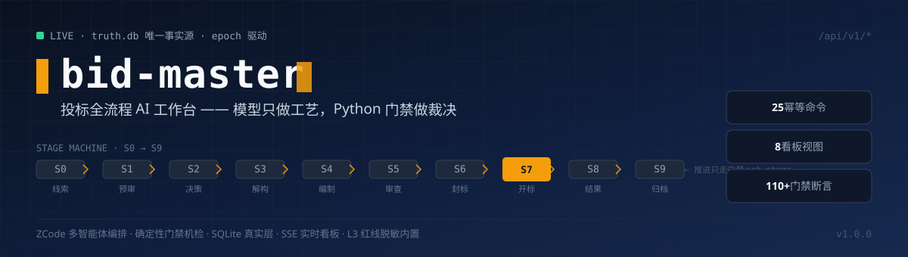
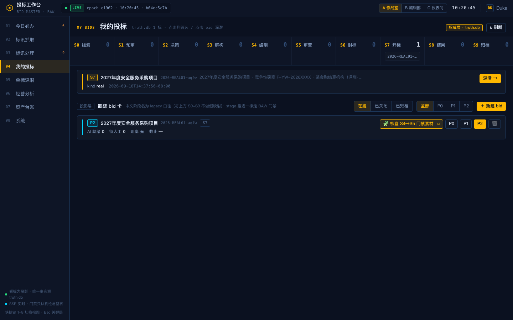
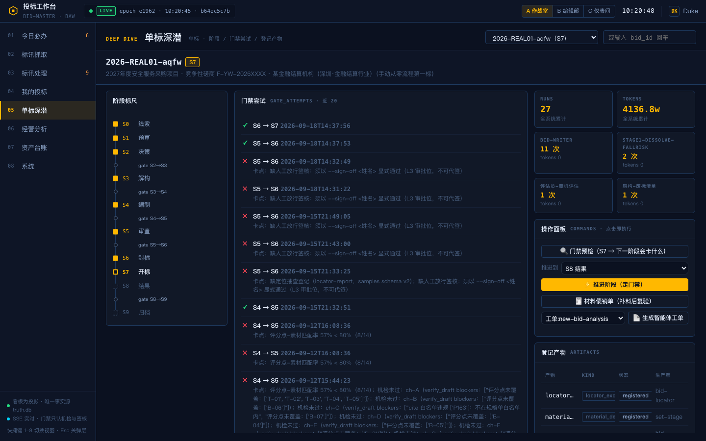
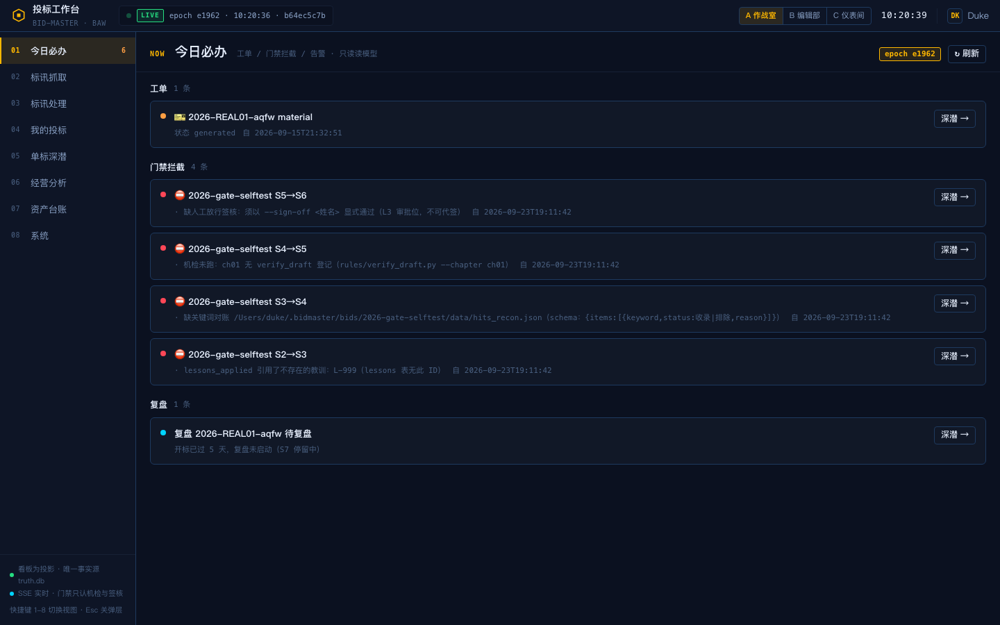
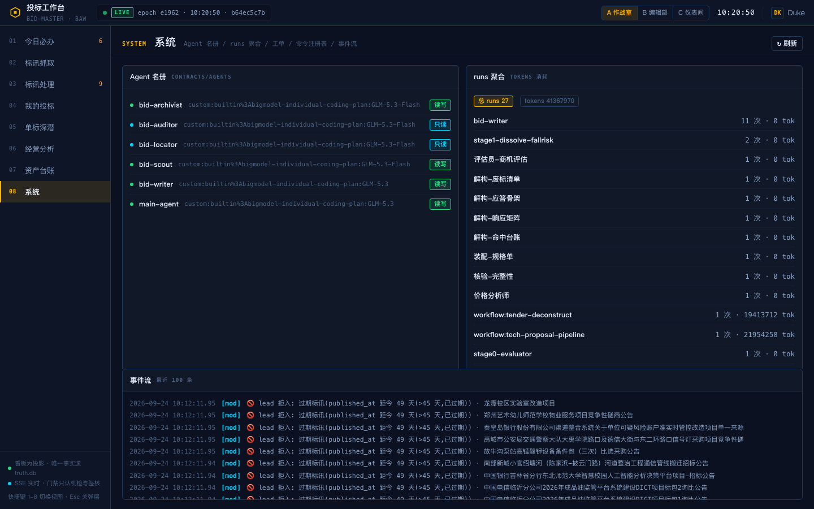

<div align="center">
  
</div>

# bid-master

**投标全流程 AI 工作台**：标讯采集 → 招标文件解构 → 技术标生产 → 机检审查 → 正式文件装配 → 开标复盘，全程装在一个带确定性门禁的系统里。

设计原则一句话：**模型只被允许"声称"，系统只相信"退出码"。** 阶段能不能推进、引用算不算命中、素材够不够 80%，全部由 Python 门禁脚本以退出码裁决；智能体的每一句"我做完了"都必须被机检或独立复核背书。多智能体编排基于 ZCode 动态工作流（workflow-as-code，可重放、可断点续跑），状态权威落 SQLite（truth.db），看板只读不拥有状态。

---

## 它长什么样

<div align="center">
  
</div>

**我的投标**——真实标从建档到开标的全生命周期，S0-S9 阶段横轨 + BAW 权威卡直读 truth.db；右下投影层是 legacy 视图落位，标明"阶段推进一律走 BAW 门禁"，不做假映射。

<div align="center">
  <table>
    <tr>
      <td width="50%"></td>
      <td width="50%"></td>
    </tr>
    <tr>
      <td align="center"><sub>单标深潜：门禁尝试史（每条拦截写明缺什么、按什么格式补）、产物登记、命令直达操作面板</sub></td>
      <td align="center"><sub>今日必办：工单 / 门禁拦截 / 死线 / 复盘提醒四类待办的读模型聚合，自测流量与真实流量同屏</sub></td>
    </tr>
  </table>
  <table>
    <tr>
      <td width="100%"></td>
    </tr>
    <tr><td align="center"><sub>系统视图：契约化智能体名册（模型绑定 + 只读属性）、运行遥测、25 条幂等命令注册表、事件流</sub></td></tr>
  </table>
</div>

> 截图已按 L3 纪律脱敏：客户以"别名 + 行业"表述、项目编号遮蔽（详见文末声明）。

---

## 核心设计

```
ZCode 动态工作流（编排层，.zcode/workflows/*.dwf.ts）
  └─ 契约化工位 actor（persona 绑定 skills/<role>/SKILL.md + 教训库）
       └─ rules/ 门禁与机检（set_stage / verify_draft / verify_audit / desensitize / validate_leads）
            └─ truth.db（唯一事实源：阶段机 / 产物登记 / 门禁尝试 / 遥测 / 教训）
                 └─ 看板（读模型直读，8 视图，SSE + epoch 轮询 ≤2s 感知）
```

- **S0-S9 阶段机**：线索 → 预审 → 决策 → 解构 → 编制 → 审查 → 封标 → 开标 → 结果 → 归档；每次推进只走 `rules/set_stage.py` 唯一写口，十道门禁逐段裁决（教训引用验真 / 关键词对账 100% / 素材匹配 ≥80% / 机检登记 / **S5→S6 人工签核不可代签**）。
- **四层裁决**：门禁（退出码）→ 机检（引用白名单 / 评分点覆盖 / 字数 / 引文逐字比对）→ 只读对抗审查（找茬不写作，报告由编排器落盘，杜绝自检）→ 视觉验收（渲染页逐页 verdict）。
- **写操作全走命令注册表**：25 条幂等命令（`Idempotency-Key` + `Payload-Hash`，同 key 同 hash 返 `_replay`、异 hash 返 409），事务化 + 审计，前端不直写数据库。
- **L3 红线内置**：成本价 / 折扣 / 客户名单 / 证件号 / 证书编号不进任何 prompt、不落任何产物；`desensitize.py` 七类模式机检（含 xlsx 容器扫描）+ 出云 payload 两级脱敏。
- **涉密壳模式**：涉密标以壳建档，只跟踪元数据（别名 / 金额 / 死线 / 阶段），内容零入库；内容门禁对壳全豁但每次放行留痕（`gate_attempts` 照落）。

## 工作流（可复用编排）

| 工作流 | 覆盖段 | 关键机制 |
|---|---|---|
| `tender-deconstruct` | S2→S4 招标解构 | 并行解构×4（响应矩阵 / 废标清单 / 应答骨架 / 命中台账 100% 对账）+ 独立只读核验员闭环 |
| `tech-proposal-pipeline` | S4→S5 技术标生产 | 每章一写手并行扩写 → 机检打回（≤3 轮）→ 定位抽查 → 对抗审查 → **错误按类型路由**（引用错→审查员，引文错→写手） |
| `lead-scout-triage` | S2 前标讯初筛 | 并行三分类打分 → 校准员查尺度 → `validate_leads` 机检 |
| `archive-close-proposal` | S8→S9 归档复盘 | 复盘提案（supersession 必填）→ 脱敏机检 → 只提案不落库，人工确认 |

全部 args 化（`saved: { name, args: { bidId } }` 一句调用）；支持断点续跑（已完成工位零成本导入，实测失败重跑成本 −48%）。另有按 13 问问卷生成的参数化全流程模板（`bid-flow-s2s9-full`）。

## 仓库结构

```
bid-master/
├── app/                     # 看板服务（web/api/services/store 四层）
│   ├── api/                 #   按域路由：bids/leads/commands/views/ops/stream…
│   ├── services/            #   领域服务：command_engine / bid_commands / digest / scheduler…
│   └── store/app_db.py      #   服务自有库 app.db（leads 观察层 / 事件 / 命令审计）
├── rules/                   # BAW 规则层：truth.db 唯一写口 store.py、set_stage 门禁、五件机检、脱敏
├── mcp/bid_master_mcp.py    # MCP server（12 工具：状态 / 门禁探针 / 推进 / 工单…）
├── .zcode/
│   ├── workflows/*.dwf.ts   # 动态工作流（编排契约见 contracts/workflows/）
│   └── agents/*.md          # 项目级智能体定义（与 contracts/agents/ 由 make gate 校验一致）
├── skills/<role>/SKILL.md   # 角色工艺手册（6 本，开工必读）
├── contracts/               # agents / artifacts / gates / workflows 契约
├── public/index.html        # 看板 SPA（8 视图 · 三主题换肤 · 版本握手自愈）
├── scripts/                 # 标讯采集 / 线索入库 Skill 脚本
├── tests/                   # 门禁安全带 36 + API 契约 43 + 真实层 23 + 云脱敏 12 断言
├── docs/                    # 设计 / API 规格 / 运维 / 复盘（含归档 PRD）
├── kb/index/                # 知识库索引=契约（元数据级；原件在数据面，不入库）
├── start.sh / Makefile      # 启停 + 工程门禁入口
└── DEV_LOG.md               # 开发记录（DEV-0001 起，全量可溯源）

~/.bidmaster/                # 数据面（唯一事实源，永不进仓库）
├── truth.db                 #   标域权威：bids / stage_history / gate_attempts / artifacts / runs / lessons / tickets
├── app.db                   #   服务自有：leads / events / command_execution / activity_log
└── bids/ leads/ kb/ backup/ …   # 生产层工作区 / 线索池 / 素材库 / 每周备份
```

## 快速开始

```bash
# 依赖：Python 3.11+（抓取引擎可选：make install-capture 装 crawl4ai + playwright）
git clone https://github.com/anyeduke11/bid-master.git
cd bid-master

./start.sh          # 启动看板 → http://127.0.0.1:8080/
./start.sh stop     # 停止

make gate           # 全量工程门禁（语法 / JSON / agent 契约 / 仓库卫生 / 测试 / API / truth / skills 八合一）
make selftest       # 脱敏机检自测（七类模式样本）
make regress        # 金标准回归（公开库自动跳过本地保留件的指纹核对段）
```

首次启动自动在 `~/.bidmaster/` 初始化数据面；所有写操作经 `/api/v1/commands` 幂等网关（25 条命令的参数 schema 见 `GET /api/v1/commands`）。API 全表见 [docs/api-reference.md](docs/api-reference.md)，前后端契约基准见 [docs/api-contract-matrix.md](docs/api-contract-matrix.md)。

## 测试与质量

- **110+ 项断言**挂 `make gate`（pre-commit 同套），每次提交双门禁（安全钩子扫描 + make gate）；
- 门禁安全带 36 断言：十道阶段门禁的正反用例（真标被拦 / 壳豁免放行互为对照）、签核不可代签、素材债登记；
- API 契约 43 断言 + golden 快照（`tests/golden/api-snapshots/`，25 命令含 schema）；
- 真实层 23 断言：kind 校验 / epoch bump / 死线八态 / S7 复盘提醒自消；
- 运行实测：单次门禁 0-3ms、看板感知 2.1s、真标全链路（解构 71min 四门禁全过 → 十章生产 58min 机检全过 → 51 页正式 docx 装配零错误）。

## 工程纪律（这个仓库怎么管自己）

- `AGENTS.md` 是最高运行纪律：数据面唯一写口 / 只读收割 / L3 红线 / 产物登记制 / 单 bid 单会话；
- 每次修复必须与验证同批交付（DEV_LOG 每条含测试命令与结果）；
- 看板自带可观测性：客户端诊断信标、版本握手自愈（服务更新后已打开页面自动 reload）、epoch 全局重渲染；
- `tests/golden/goldstd/` 为本地保留件（客户招标文档指针与引文），已 gitignore，公开库跳过其指纹核对。

## 文档

[API 规格](docs/api-reference.md) · [契约矩阵](docs/api-contract-matrix.md) · [BAW 设计](docs/baw-design-v3.md) · [需求基线](docs/designs/bid-master-requirements-baseline-20260919.md) · [数据面协议](docs/data-plane-protocol.md) · [丢弃按钮六轮复盘](docs/RETRO-001%20·%20丢弃按钮功能失效六轮复盘.md) · [运维调度](docs/ops-cron.md)

## 脱敏声明

本公开仓库已整体脱敏：真实客户一律以"别名 + 行业"表述（某金融结算机构 / 某证券通信机构等）、磋商项目编号遮蔽（F-YW-2026XXXX）、竞对与同标次参与者匿名；不含成本价、折扣、证件号、证书编号；金标准原文与投标产物仅存本地数据面，不入库。截图为运行时脱敏后采集，落盘前经敏感词零残留断言。

## 演进

| 版本 | 时间 | 里程碑 |
|---|---|---|
| v0.3.2 | 2026-08 | 看板原型（11 命令注册表 / 幂等 / SSE，PRD v5.2 终稿） |
| v0.5.0 | 2026-09 上旬 | BAW 真实层 truth.db：阶段机唯一写口 + 产物登记制 + 门禁尝试 |
| v1.0 | 2026-09 中旬 | 多智能体工作流实跑：真标解构→十章生产→51 页正式文件；MCP + CLI 联动 |
| 需求基线 + 镜子优先 | 2026-09 下旬 | 四层需求架构定稿；涉密壳 / 死线复盘提醒 / 云脱敏扩展 / 调度内置化（本文版本） |

---

<div align="center">
  <sub>LLM 做工艺 · Python 做裁决 —— <a href="docs/RETRO-001%20·%20丢弃按钮功能失效六轮复盘.md">系统自己抓住自己 ≥10 处问题，无一依赖人眼</a></sub>
</div>
